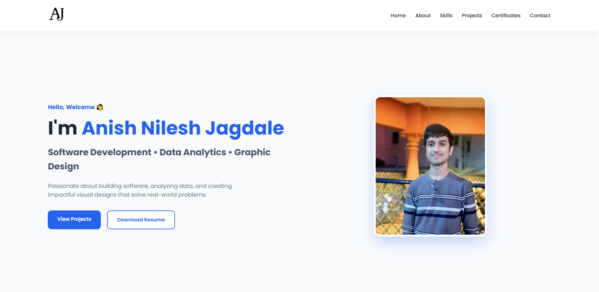

# 🌐 Personal Portfolio | Anish Jagdale

Welcome to my personal portfolio website! This portfolio showcases my technical skills, projects, certifications, and graphic design work as I continue my journey in software development and data analytics.

## 🚀 Live Portfolio

🔗 **Visit Here:**  
https://anishjagdale.github.io/Portfolio/

---

## 📖 About

I am a B.Tech Computer Science and Business Systems student with a passion for software development, data analytics, and building impactful digital solutions. This portfolio serves as a central place to showcase my work, skills, and achievements.

---

## ✨ Features

- 🏠 Responsive Home Page
- 👨‍💻 About Me Section
- 🛠 Technical Skills
- 📂 Project Showcase
- 📜 Certificates
- 🎨 Graphic Design Portfolio
- 📞 Contact Section
- 📱 Mobile-Friendly Design

---

## 🛠 Tech Stack

- HTML5
- CSS3
- JavaScript
- Git
- GitHub
- GitHub Pages
- Visual Studio Code

---

## 📂 Current Projects

- 🌐 Personal Portfolio Website
- 🎨 Graphic Design Portfolio

> More software development and data analytics projects will be added as I continue learning and building.

---

## 📸 Preview

## 📫 Connect with Me

- 🌐 Portfolio: https://anishjagdale.github.io/Portfolio/
- 💼 LinkedIn: https://www.linkedin.com/in/anishjagdale2442
- 💻 GitHub: https://github.com/AnishJagdale

---

## ⭐ Future Improvements

- Add more software development projects
- Add data analytics and Power BI projects
- Enhance UI/UX
- Improve animations and accessibility

---

### Thank you for visiting my portfolio! 😊
